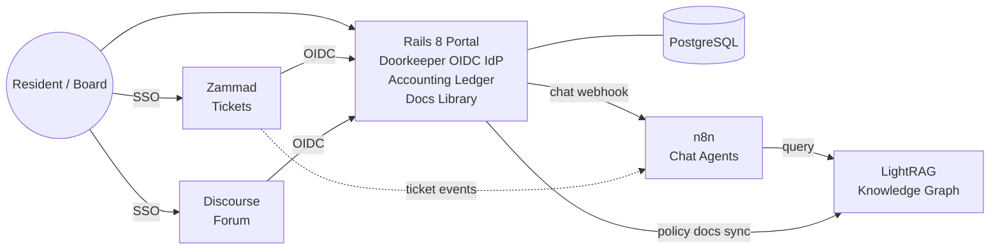

## Project Conventions

- **Name:** `Tatl` (Rails app module: `Tatl`, image: `tatl/portal`, ECR repo: `tatl-portal`, S3 buckets: `tatl-staging-uploads`, `tatl-prod-uploads`, `tatl-backups`).
- **Domain:** placeholder `tatl.local` for dev, `tatl.example` in docs/configs until a real domain is purchased. Centralized in `infra/compose/.env.<env>.example` as `APP_DOMAIN=` so it's a one-liner swap later.
- **Region:** AWS `us-east-2` (Ohio) - closest AWS region to Tennessee with full service parity.
- **Repo:** single monorepo (`apps/portal/`, `infra/`, `docs/`, `.github/workflows/`).
- **Dev runtime:** Native on Windows. Host has Ruby 3.4.8, Rails 8.1.3, Bundler 4, Node 22, Git, and PostgreSQL 18 (Windows service `postgresql-x64-18`). Rails dev server runs natively via `bin/dev`. Docker is reserved for later slices (Zammad, Discourse, n8n, LightRAG locally; full stack on AWS EC2 in staging/prod).
- **Local Postgres:** running as Windows service. Dedicated `tatl` role (password `tatl_dev`) owns `tatl_development` and `tatl_test`. PG bin (`C:\Program Files\PostgreSQL\18\bin`) needs to be on PATH for `psql`, `createdb`, etc. Credentials live in `.env.development` (gitignored) and Rails `database.yml`.
- **Execution order:** ship in thin slices, starting with Slice 1 = Rails portal foundation only (Rails 8 + Postgres + Tailwind + Solid Queue/Cache/Cable + RSpec stack + Devise + Pundit + lint/`bin/ci`). Doorkeeper/OIDC, accounting, RAG, AWS infra, Zammad/Discourse/n8n/LightRAG come in later slices.

## Architecture

## Stack

- **Rails 8** (Hotwire/Turbo, Stimulus, Propshaft, Solid Queue/Cache/Cable, importmap or esbuild)
- **PostgreSQL 16** - separate logical DBs per service (portal, zammad, discourse)
- **Zammad** (latest) - self-hosted OSS helpdesk (Rails-based), OIDC client
- **Discourse** (latest) - forum, OIDC client via `discourse-openid-connect` plugin
- **n8n** - workflow/chat agent runtime
- **LightRAG** (HKUDS) - knowledge graph + retrieval API
- **Docker Compose** - same `docker-compose.yml` runs locally and on EC2 with env overlays
- **AWS** - EC2 (per env) hosts the Compose stack; RDS Postgres 16 (managed, with backups); S3 for Active Storage + DB/LightRAG backups; ECR for portal images
- **Cloudflare** - authoritative DNS (DNS-only records to EC2 elastic IPs); SendGrid DKIM/SPF/DMARC live here too
- **SendGrid** - transactional email (Action Mailer SMTP) for Devise confirmations/resets, dues notices, ticket and chat notifications

## Rails App Layout

Models (key ones):

- `User` (Devise) with role enum: `resident`, `board`, `treasurer`, `admin`
- `Property` (unit/lot), `Membership` (User <-> Property), `OwnershipPeriod`
- `Document` (policy/bylaws/minutes) with Active Storage + LightRAG sync state
- **Accounting (ledger-lite):**
  - `Account` (categories: Operating, Reserve, Income, Expense, etc.)
  - `Transaction` (date, amount, account, memo, attachment)
  - `DuesAssessment`, `DuesPayment` (linked to Property)
  - `BudgetLine` per fiscal year
- `OauthApplication`, `AccessToken` (Doorkeeper)
- `ChatSession`, `ChatMessage` (proxied to n8n)

Controllers / namespaces:

- `Portal::`* - dashboard, documents, dues, payments
- `Accounting::`* - admin/treasurer tools, reports
- `Chat::`* - chat UI -> POSTs to n8n webhook, streams reply via Turbo Streams
- `Oauth::`* - mounted from Doorkeeper
- `Webhooks::`* - receive events from Zammad/Discourse/n8n

Key gems (runtime):

- `devise` (with `:confirmable`, `:lockable`, `:trackable`) for authentication
- `doorkeeper`, `doorkeeper-openid_connect` for OIDC IdP
- `pundit` for role-based authorization (every controller `include Pundit::Authorization`, `after_action :verify_authorized` in admin namespaces)
- `pagy`, `view_component`, `tailwindcss-rails`
- `money-rails` for currency, `groupdate` + `chartkick` for reports
- `httpx` or `faraday` for service clients (Zammad, Discourse, n8n, LightRAG)
- `dotenv-rails` (dev/test only), `lockbox` for any sensitive fields
- `lograge`, `sentry-ruby` + `sentry-rails` for prod observability

Key gems (test/dev):

- `rspec-rails`, `factory_bot_rails`, `faker`
- `shoulda-matchers`, `rails-controller-testing`
- `capybara`, `cuprite` (headless Chrome via CDP) for system specs
- `webmock`, `vcr` for HTTP isolation (n8n, LightRAG, Zammad, Discourse)
- `pundit-matchers` for policy specs
- `simplecov` (with branch coverage) - fail CI under threshold
- `rubocop`, `rubocop-rails`, `rubocop-rspec`, `rubocop-performance`, `erb_lint`
- `brakeman`, `bundler-audit`

## Testing Strategy (RSpec)

Layout under `apps/portal/spec/`:

- `models/` - validations, scopes, associations, role transitions, ledger math
- `policies/` - Pundit specs per role (`resident`, `board`, `treasurer`, `admin`) using `pundit-matchers`
- `requests/` - controller-level: portal, accounting, oauth (OIDC discovery/JWKS/userinfo), webhooks
- `system/` - end-to-end Capybara + Cuprite (login, dues payment flow, document upload, chat round-trip)
- `jobs/` - LightRAG sync, chat dispatch (with VCR cassettes)
- `services/` - clients for Zammad/Discourse/n8n/LightRAG (WebMock-stubbed)
- `support/` - shared contexts (`sign_in_as(role)`), VCR config, factories

Conventions:

- FactoryBot factories for every model with role traits (`create(:user, :treasurer)`)
- `Rails.application.config.active_job.queue_adapter = :test` in tests; use `perform_enqueued_jobs` blocks
- All outbound HTTP blocked by default via `WebMock.disable_net_connect!(allow_localhost: true)`
- SimpleCov threshold (start at 85% line / 75% branch) enforced in CI
- `bin/ci` runs the same suite locally as in CI: `rubocop && erb_lint && brakeman && bundle exec rspec`

## Environments (local / staging / production)

Three environments, same Docker Compose stack, parameterized by env files. Staging and production live on AWS EC2 with RDS + S3 + SendGrid + Cloudflare DNS.

- **Local development** (`docker-compose.yml` + `.env.development`)
  - Caddy serves `*.local` with internal CA
  - Postgres, Redis, Elasticsearch, Memcached run as containers locally
  - Rails in dev mode via `bin/dev`, hot reload
  - Seeded with fixtures from `db/seeds/development.rb`
  - LightRAG points at OpenAI by default; n8n imports workflows from `infra/n8n/workflows/`
  - SendGrid replaced with `letter_opener_web` so no real emails are sent
- **Staging** (`docker-compose.staging.yml` overlay + `.env.staging`, on AWS EC2)
  - Single EC2 instance (`t3.medium` to start) running the Compose stack
  - Postgres moves to **RDS** (single-AZ, `db.t3.small`) with separate logical DBs `portal`, `zammad`, `discourse`
  - Active Storage uses **S3** (`hoa-staging-uploads`) via EC2 instance profile
  - **Caddy** + **Let's Encrypt** for `portal.staging.<domain>`, `tickets.staging.<domain>`, `forum.staging.<domain>`, `chat.staging.<domain>`
  - **Cloudflare DNS** records, DNS-only (gray cloud) so HTTP-01 ACME works directly to the EC2 elastic IP
  - **SendGrid** with `staging` API key and `no-reply+staging@<domain>` sender; DKIM/SPF/DMARC in Cloudflare
  - Rails `RAILS_ENV=production` with `STAGING=1` flag (separate Sentry project, UI banner, `robots.txt` disallow)
  - Anonymized seed data; `bin/staging-reset` re-seeds RDS + LightRAG
  - Auto-deploys on every merge to `main`
- **Production** (`docker-compose.production.yml` overlay + `.env.production`, on AWS EC2)
  - Right-sized EC2 instance (start `t3.large`, revisit after profiling)
  - **RDS** Multi-AZ Postgres with automated backups (30-day retention) plus daily logical `pg_dump` to S3 for offsite
  - **S3** Active Storage bucket (`hoa-prod-uploads`) with versioning + lifecycle rules
  - LightRAG storage volume snapshotted nightly to S3 via cron sidecar
  - **Caddy** + Let's Encrypt for prod hostnames; **Cloudflare DNS** in DNS-only mode
  - **SendGrid** with verified domain sender; DMARC progresses `none` -> `quarantine` -> `reject` after warm-up
  - Real `RAILS_MASTER_KEY` / encrypted credentials per env
  - Deploys only from tagged releases via manual GitHub Actions approval

AWS scope (intentionally small for MVP):

- 1 VPC per env with public subnet (EC2) + private subnets (RDS), security group locked so only EC2 SG reaches RDS
- 1 RDS Postgres instance per env (staging single-AZ, prod Multi-AZ)
- 1 ECR repo for the `portal` image
- 1 S3 bucket per env for Active Storage, plus a shared `hoa-backups` bucket
- IAM: GitHub Actions deploy role via OIDC (no long-lived keys); EC2 instance profile with S3 + ECR pull
- CloudWatch agent on EC2 for system metrics + Docker log shipping; Sentry for app-level errors

Configuration approach:

- One `docker-compose.yml` (base) + `docker-compose.<env>.yml` overlays. Staging/prod overlays remove the `postgres` service and point `DATABASE_URL` at RDS.
- Secrets: Rails encrypted credentials (`config/credentials/<env>.yml.enc`) for app secrets; AWS Secrets Manager holds the RDS master password and SendGrid API key, injected into the env file at deploy time.
- All three envs run the identical Rails image so behavior parity is enforced.

## Email (SendGrid)

- ActionMailer SMTP via `smtp.sendgrid.net:587` with API-key auth (single sender per env)
- Per-env API keys with `mail.send` scope only
- Cloudflare DNS holds SendGrid CNAMEs for DKIM, SPF `include:sendgrid.net`, and a DMARC TXT record
- Dev uses `letter_opener_web` mounted at `/letters`; specs use `ActionMailer::Base.deliveries`
- Mailers: Devise (confirmation/reset/unlock), dues notices, ticket reply digests, chat-summary digests
- SendGrid webhook (event subscription) hits `Webhooks::SendgridController` for bounce/complaint suppression, with signature verification and request specs

## DNS (Cloudflare)

- Single hosted zone in Cloudflare with subdomains per env (`portal.<domain>`, `portal.staging.<domain>`, etc.)
- DNS-only A records to EC2 elastic IPs (proxy off) so Let's Encrypt HTTP-01 works directly; revisit Cloudflare proxy mode later if we want WAF/CDN
- API-token-scoped Terraform later if we automate DNS; for MVP, manual record management is fine

## CI / CD (GitHub Actions)

- `ci.yml` on every PR: `rubocop`, `erb_lint`, `brakeman`, `bundler-audit`, `rspec` (matrix: unit + system), upload `coverage/` artifact
- `build.yml` on push to `main`: assume AWS deploy role via OIDC, build & push `portal` image to **ECR** tagged `:main` and `:sha-<short>`
- `deploy-staging.yml`: SSH to staging EC2, `aws ecr get-login-password | docker login`, `docker compose pull && docker compose up -d`, run `db:migrate`, smoke test against `portal.staging.<domain>`
- `deploy-production.yml`: manual trigger on a Git tag; same flow against prod EC2 with maintenance-mode toggle, RDS pre-deploy snapshot, and post-deploy backup verification

## SSO Flow (OIDC)

1. Rails registers two Doorkeeper OAuth applications: `zammad`, `discourse`, each with its callback URL and `openid profile email` scopes.
2. Discourse `discourse-openid-connect` plugin configured with Rails' `/oauth/authorize`, `/oauth/token`, `/oauth/userinfo`, and JWKS endpoints.
3. Zammad configured via Admin > Security > Third-party > OIDC pointing at the same endpoints.
4. User claims include `sub`, `email`, `name`, and a custom `roles` claim (configured via `doorkeeper-openid_connect` `protocols` block) so Zammad/Discourse can map board/admin to elevated groups.

## RAG / Chat Path

- **Indexing:** When a `Document` is created/updated, an Active Job posts the file to LightRAG's `/documents` insert endpoint. Sync state stored on the model (`pending`, `indexed`, `failed`, `last_indexed_at`).
- **Chat:** `Chat::MessagesController#create` persists the user's message, then calls an n8n webhook (`/webhook/hoa-chat`) with `{session_id, user_id, role, query}`. n8n workflow:
  1. Calls LightRAG `/query` (mode: `hybrid`)
  2. Optionally pulls context from Zammad/Discourse APIs
  3. Calls the LLM and posts the streamed reply back to a Rails callback URL (`/webhooks/n8n/chat`)
- Rails broadcasts the reply via Turbo Streams (Solid Cable) to the chat UI.

## Accounting (ledger-lite)

- Single-entry style: each `Transaction` belongs to one `Account` and carries a signed amount (positive = inflow).
- Reports: monthly P&L per fund, dues aging by property, reserve balance over time.
- CSV import for bank statements; optional later: OFX/Plaid.
- Treasurer-only writes via Pundit policies; residents see only their own dues/payments.

## Docker Compose Services

- `portal` (Rails) + `portal-worker` (Solid Queue)
- `postgres` (shared, multiple databases via init script)
- `zammad-railsserver`, `zammad-websocket`, `zammad-scheduler`, `zammad-elasticsearch`, `zammad-memcached` (per official compose)
- `discourse` + `discourse-redis`
- `n8n`
- `lightrag` (their `lightrag-server` image)
- `caddy` reverse proxy with automatic HTTPS for `portal.local`, `tickets.local`, `forum.local`, `chat.local`

## Repo Layout

- `apps/portal/` - Rails app (with `spec/` for RSpec)
- `infra/compose/` - `docker-compose.yml` (base) + `docker-compose.staging.yml` + `docker-compose.production.yml` + `Caddyfile.<env>` + env templates (`.env.development.example`, `.env.staging.example`, `.env.production.example`)
- `infra/postgres/init/` - dev-only DB creation script for zammad, discourse, portal databases (RDS handles this in staging/prod)
- `infra/lightrag/` - config + initial document seed script
- `infra/n8n/workflows/` - exported JSON for the HOA chat workflow
- `infra/aws/` - bootstrap notes / optional Terraform stubs for VPC, RDS, S3, ECR, IAM OIDC role
- `infra/scripts/` - `deploy.sh`, `staging-reset.sh`, `backup.sh`, `restore.sh`
- `.github/workflows/` - `ci.yml`, `build.yml`, `deploy-staging.yml`, `deploy-production.yml`
- `docs/` - `architecture.md`, `testing.md`, `runbook.md`, `sso.md`, `environments.md`, `aws.md`, `email.md`

