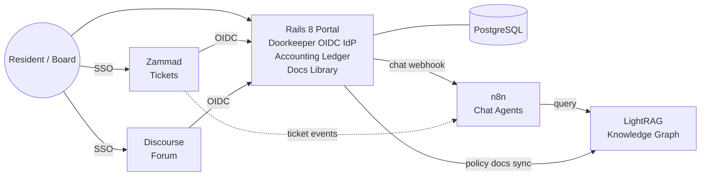

## Project Conventions

- **Name:** `Tatl` (Rails app module: `Tatl`, S3 bucket: `tatl-staging-uploads`).
- **Domain:** no domain purchased yet. Staging accessed via Elastic IP `3.146.142.26` over HTTP. Cloudflare DNS + HTTPS planned for when a domain is acquired.
- **Region:** AWS `us-east-2` (Ohio) - closest AWS region to Tennessee with full service parity.
- **Repo:** single monorepo (`apps/portal/`, `infra/`, `.github/workflows/`). GitHub: `MattGLut/Tatl`.
- **Branch model:** `develop` (staging auto-deploy), `master` (production, future). Feature branches PR into `develop`.
- **Dev runtime:** Native on Windows. Ruby 3.4.8, Rails 8.1.3, Bundler 4, Node 22, Git, PostgreSQL 18 (Windows service). Rails dev server runs natively via `ruby bin/rails server`. Docker reserved for later slices (sidecar services only).
- **Local Postgres:** Windows service `postgresql-x64-18`. Role `tatl` (password `tatl_dev`) owns `tatl_development` and `tatl_test`. PG bin (`C:\Program Files\PostgreSQL\18\bin`) on PATH. Credentials in `.env.development` (gitignored).
- **Staging runtime:** EC2 Ubuntu 24.04, rbenv Ruby 3.4.8, systemd units for Puma + Solid Queue, Caddy reverse proxy. `deploy` user owns `/opt/tatl`. Env vars in `/opt/tatl/.env.production`.
- **Execution order:** ship in thin slices. Slices 1-5 (complete) = Rails foundation + Devise + Pundit + RSpec + CI/CD + AWS staging + SendGrid email + core domain models (Property, Membership, Document) + Doorkeeper OIDC IdP + Accounting Ledger. Next = documents/LightRAG, then chat/n8n, sidecar services.

## Architecture

## Stack

- **Rails 8** (Hotwire/Turbo, Stimulus, Propshaft, Solid Queue/Cache/Cable, importmap or esbuild)
- **PostgreSQL 16** - separate logical DBs per service (portal, zammad, discourse)
- **Zammad** (latest) - self-hosted OSS helpdesk (Rails-based), OIDC client
- **Discourse** (latest) - forum, OIDC client via `discourse-openid-connect` plugin
- **n8n** - workflow/chat agent runtime
- **LightRAG** (HKUDS) - knowledge graph + retrieval API
- **Docker Compose** (future) - for sidecar services (Zammad, Discourse, n8n, LightRAG) only; Rails runs natively
- **AWS** - EC2 hosts Rails natively via systemd; RDS Postgres 16 (managed); S3 for Active Storage; no ECR needed (no Docker for Rails)
- **Caddy** - lightweight reverse proxy on EC2, port 80 -> localhost:3000 (HTTPS via Let's Encrypt when domain is ready)
- **SendGrid** - transactional email (Action Mailer SMTP) for Devise confirmations/resets, dues notices, ticket and chat notifications
- **Cloudflare** (future) - authoritative DNS once a domain is purchased; DKIM/SPF/DMARC for SendGrid

## Rails App Layout

Models (key ones):

- `User` (Devise) with role enum: `resident`, `board`, `treasurer`, `admin`; `has_many :memberships`, `has_many :properties`, `has_many :uploaded_documents`
- `Property` (unit/lot) with `name`, `street_address`, `city`, `state`, `zip`, `lot_number` (unique), `property_type` enum (`single_family`, `townhome`, `condo`, `lot`)
- `Membership` (User <-> Property) with `role` enum (`owner`, `resident`, `tenant`), `started_on`, `ended_on` (nil = active); unique composite index; scopes: `active`, `ended`, `for_user`, `for_property`
- `Document` (policy/bylaws/minutes) with Active Storage file attachment, `category` enum, `published_at` (nil = draft), `rag_sync_status` enum (`pending`, `indexed`, `failed`), `last_indexed_at`; scopes: `published`, `drafts`, `by_category`, `recent`
- **Accounting (ledger-lite):**
  - `Account` (categories: Operating, Reserve, Income, Expense, etc.)
  - `Transaction` (date, amount, account, memo, attachment)
  - `DuesAssessment`, `DuesPayment` (linked to Property)
  - `BudgetLine` per fiscal year
- `OauthApplication`, `AccessToken` (Doorkeeper)
- `ChatSession`, `ChatMessage` (proxied to n8n)

Controllers / namespaces:

- `PropertiesController` - CRUD for properties (staff manages, residents view own via policy scope)
- `MembershipsController` - nested under properties (staff-only create/edit/destroy)
- `DocumentsController` - index/show/new/create/destroy with category filtering (staff manages, residents see published only)
- `Portal::`* (future) - dashboard, dues, payments
- `Accounting::`* - admin/treasurer tools, reports
- `Chat::`* - chat UI -> POSTs to n8n webhook, streams reply via Turbo Streams
- `Oauth::`* - mounted from Doorkeeper
- `Webhooks::`* - receive events from Zammad/Discourse/n8n

Key gems (runtime):

- `devise` (with `:confirmable`, `:lockable`, `:trackable`) for authentication
- `doorkeeper`, `doorkeeper-openid_connect` for OIDC IdP
- `pundit` for role-based authorization (every controller `include Pundit::Authorization`, `after_action :verify_authorized` in admin namespaces)
- `pagy`, `view_component`, `tailwindcss-rails`
- `money-rails` for currency, `groupdate` + `chartkick` for reports
- `httpx` or `faraday` for service clients (Zammad, Discourse, n8n, LightRAG)
- `dotenv-rails` (dev/test only), `lockbox` for any sensitive fields
- `lograge`, `sentry-ruby` + `sentry-rails` for prod observability

Key gems (test/dev):

- `rspec-rails`, `factory_bot_rails`, `faker`
- `shoulda-matchers`, `rails-controller-testing`
- `capybara`, `cuprite` (headless Chrome via CDP) for system specs
- `webmock`, `vcr` for HTTP isolation (n8n, LightRAG, Zammad, Discourse)
- `pundit-matchers` for policy specs
- `simplecov` (with branch coverage) - fail CI under threshold
- `rubocop`, `rubocop-rails`, `rubocop-rspec`, `rubocop-performance`, `erb_lint`
- `brakeman`, `bundler-audit`

## Testing Strategy (RSpec)

Layout under `apps/portal/spec/`:

- `models/` - validations, scopes, associations, role transitions, ledger math
- `policies/` - Pundit specs per role (`resident`, `board`, `treasurer`, `admin`) using `pundit-matchers`
- `requests/` - controller-level: portal, accounting, oauth (OIDC discovery/JWKS/userinfo), webhooks
- `system/` - end-to-end Capybara + Cuprite (login, dues payment flow, document upload, chat round-trip)
- `jobs/` - LightRAG sync, chat dispatch (with VCR cassettes)
- `services/` - clients for Zammad/Discourse/n8n/LightRAG (WebMock-stubbed)
- `support/` - shared contexts (`sign_in_as(role)`), VCR config, factories

Conventions:

- FactoryBot factories for every model with role traits (`create(:user, :treasurer)`)
- `Rails.application.config.active_job.queue_adapter = :test` in tests; use `perform_enqueued_jobs` blocks
- All outbound HTTP blocked by default via `WebMock.disable_net_connect!(allow_localhost: true)`
- SimpleCov threshold (start at 85% line / 75% branch) enforced in CI
- `bin/ci` runs the same suite locally as in CI: `rubocop && erb_lint && brakeman && bundle exec rspec`

## Environments (local / staging / production)

- **Local development** (native Windows, no Docker)
  - Ruby 3.4.8, Rails 8.1.3, Bundler 4, PostgreSQL 18 as Windows service
  - Rails in dev mode via `bin/dev` (or `ruby bin/rails server`), hot reload
  - `.env.development` holds DB credentials (`tatl` role, password `tatl_dev`)
  - `letter_opener_web` mounted at `/letters` for email preview (no real emails)
  - Seeded with fixtures from `db/seeds/development.rb`
- **Staging** (AWS EC2, native Rails -- no Docker)
  - EC2 `t3.small` (Ubuntu 24.04) in `us-east-2`, Elastic IP `3.146.142.26`
  - Rails runs natively via **systemd** (tatl-web for Puma, tatl-worker for Solid Queue)
  - **Caddy** reverse proxy on port 80 forwarding to `localhost:3000`
  - **rbenv** + Ruby 3.4.8 installed on the server; `deploy` user owns `/opt/tatl`
  - **RDS** PostgreSQL 16 (`db.t4g.micro`, single-AZ, 1-day backup retention for Free Tier)
  - **S3** bucket `tatl-staging-uploads` for Active Storage
  - **SendGrid** SMTP for transactional email (Devise confirmations/resets/unlocks)
  - `/opt/tatl/.env.production` provides env vars (RAILS_MASTER_KEY, DB creds, SendGrid key, APP_HOST, OIDC_ISSUER, OIDC_SIGNING_KEY, etc.)
  - `RAILS_ENV=production`; access via HTTP at the Elastic IP (no domain/HTTPS yet)
  - Auto-deploys on every push to `develop` via GitHub Actions (CI passes -> deploy-staging.yml SSHs and runs `deploy.sh`)
- **Production** (future)
  - Separate EC2 instance, same native deployment pattern
  - RDS Multi-AZ Postgres with automated backups (30-day retention)
  - S3 Active Storage bucket with versioning + lifecycle rules
  - Domain + Cloudflare DNS + Caddy Let's Encrypt HTTPS
  - SendGrid with verified domain sender; DMARC progression
  - Deploys from tagged releases via manual GitHub Actions approval on `master` branch

AWS resources (staging, provisioned):

- Default VPC in `us-east-2` with public subnets
- Security groups: `tatl-staging-web` (SSH 22, HTTP 80, HTTPS 443) and `tatl-staging-rds` (Postgres 5432 from web SG only)
- EC2 key pair: `tatl-staging` (PEM at `~/.ssh/tatl-staging.pem`)
- IAM user `tatl-deployer` for AWS CLI and GitHub Actions
- GitHub Secrets: `STAGING_HOST`, `STAGING_SSH_KEY`, `RAILS_MASTER_KEY`, `TATL_DB_PASSWORD`

Configuration approach:

- Staging/production: `/opt/tatl/.env.production` sourced by `deploy.sh` before Rails commands
- Secrets not in the repo; env vars supplied via the `.env.production` file on the server and GitHub Secrets for CI/CD
- No Docker for the Rails app; sidecar services (Zammad, Discourse, n8n, LightRAG) will be containerized in later slices

## Email (SendGrid)

- ActionMailer SMTP via `smtp.sendgrid.net:587` with API-key auth (`user_name: "apikey"`, `password: ENV["SENDGRID_API_KEY"]`)
- Per-env API keys; staging uses a single sender address via `TATL_MAILER_SENDER` env var
- Dev uses `letter_opener_web` mounted at `/letters`; specs use `ActionMailer::Base.deliveries`
- Custom Tailwind-styled Devise views for sign-up, sign-in, password reset, confirmation, unlock, and email templates
- Devise permitted params include `first_name` and `last_name` for registration
- Env vars on staging EC2 (`/opt/tatl/.env.production`): `SENDGRID_API_KEY`, `APP_HOST`, `TATL_MAILER_SENDER`
- Future: Cloudflare DNS for DKIM/SPF/DMARC once a domain is purchased; SendGrid webhook for bounce/complaint suppression
- Future mailers: dues notices, ticket reply digests, chat-summary digests

## DNS (Cloudflare)

- Single hosted zone in Cloudflare with subdomains per env (`portal.<domain>`, `portal.staging.<domain>`, etc.)
- DNS-only A records to EC2 elastic IPs (proxy off) so Let's Encrypt HTTP-01 works directly; revisit Cloudflare proxy mode later if we want WAF/CDN
- API-token-scoped Terraform later if we automate DNS; for MVP, manual record management is fine

## CI / CD (GitHub Actions)

- **`ci.yml`** on every PR and push to `develop`/`master`: four parallel jobs
  - `scan_ruby`: Brakeman + bundler-audit
  - `scan_js`: importmap audit
  - `lint`: RuboCop + erb_lint
  - `test`: RSpec with Postgres 16 service container, uploads coverage artifact
  - All jobs use `working-directory: apps/portal`, `actions/checkout@v6`, `ruby/setup-ruby@v1` with `bundler-cache: true`
- **`deploy-staging.yml`**: triggered by `workflow_run` on CI completion for `develop` branch; uses `appleboy/ssh-action@v1` to SSH as `deploy` user and run `/opt/tatl/infra/scripts/deploy.sh`; followed by an HTTP smoke test against `http://<STAGING_HOST>/up`
- **`deploy-production.yml`** (future): manual trigger on a Git tag against `master`; same SSH pattern against prod EC2
- **`dependabot.yml`**: weekly checks for Bundler (`/apps/portal`) and GitHub Actions (`/`), targeting `develop` branch

Branch model: `develop` -> staging (auto), `master` -> production (manual, future)

## SSO Flow (OIDC) -- IdP deployed

Rails is now a full OIDC Identity Provider via Doorkeeper 5.9 + doorkeeper-openid_connect 1.9.

**Endpoints live on staging:**
- Discovery: `/.well-known/openid-configuration`
- Authorization: `/oauth/authorize`
- Token: `/oauth/token`
- UserInfo: `/oauth/userinfo`
- JWKS: `/oauth/discovery/keys`

**Configuration:**
- Auth code grant flow only (no implicit), RS256 JWT signing, refresh tokens enabled, 1-hour access token expiry.
- Signing key: ephemeral in dev/test, persistent via `OIDC_SIGNING_KEY` env var in staging/production. Generate with `rake oidc:generate_signing_key`.
- Claims: `sub`, `iss`, `email`, `email_verified`, `name`, `given_name`, `family_name`, and custom `roles` (in both ID token and UserInfo).
- OAuth apps for Zammad and Discourse can be seeded via `rake oidc:seed_applications` (placeholder redirect URIs until those services are deployed).

**Remaining (future slices):**
1. Discourse `discourse-openid-connect` plugin configured with the above endpoints.
2. Zammad configured via Admin > Security > Third-party > OIDC pointing at the same endpoints.
3. Verify role mapping (admin/board -> elevated groups) in all three envs.

## RAG / Chat Path

- **Indexing:** When a `Document` is created/updated, an Active Job posts the file to LightRAG's `/documents` insert endpoint. Sync state stored on the model (`pending`, `indexed`, `failed`, `last_indexed_at`).
- **Chat:** `Chat::MessagesController#create` persists the user's message, then calls an n8n webhook (`/webhook/hoa-chat`) with `{session_id, user_id, role, query}`. n8n workflow:
  1. Calls LightRAG `/query` (mode: `hybrid`)
  2. Optionally pulls context from Zammad/Discourse APIs
  3. Calls the LLM and posts the streamed reply back to a Rails callback URL (`/webhooks/n8n/chat`)
- Rails broadcasts the reply via Turbo Streams (Solid Cable) to the chat UI.

## Accounting (ledger-lite)

- Single-entry style: each `Transaction` belongs to one `Account` and carries a signed amount (positive = inflow).
- Reports: monthly P&L per fund, dues aging by property, reserve balance over time.
- CSV import for bank statements; optional later: OFX/Plaid.
- Treasurer-only writes via Pundit policies; residents see only their own dues/payments.

## Sidecar Services (future, Docker Compose)

- `zammad-railsserver`, `zammad-websocket`, `zammad-scheduler`, `zammad-elasticsearch`, `zammad-memcached`
- `discourse` + `discourse-redis`
- `n8n`
- `lightrag` (HKUDS `lightrag-server` image)
- May run on the same EC2 or a dedicated instance depending on resource needs for ~200 users

## Repo Layout

- `apps/portal/` - Rails 8 app (with `spec/` for RSpec)
- `infra/aws/` - `provision-staging.sh` (AWS CLI script to create SGs, EC2, RDS, S3, EIP)
- `infra/scripts/` - `setup-server.sh` (one-time EC2 bootstrap), `deploy.sh` (per-deploy: pull, bundle, migrate, precompile, restart)
- `infra/caddy/` - `Caddyfile.staging` (reverse proxy config)
- `infra/systemd/` - `tatl-web.service` (Puma), `tatl-worker.service` (Solid Queue)
- `.github/workflows/` - `ci.yml`, `deploy-staging.yml`
- `.github/dependabot.yml` - weekly Bundler + Actions updates targeting `develop`
- `docs/` (future) - `architecture.md`, `testing.md`, `runbook.md`, `sso.md`, `environments.md`

